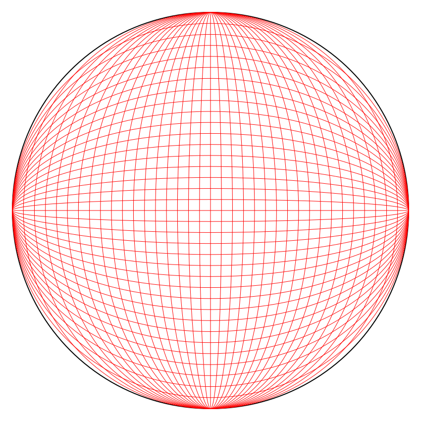

# Five-Point Perspective SVGs in Python

This was a fun Friday-night experiment with a buddy who is learning 5-point perspective drawing. Wanted to figure out how to programmatically make a 5-point perspective grid, and learned the DrawSVG library in the process. 

Requires **jupyter** along with **numpy** and **drawSvg**. 

Our first attempt was based on creating circular arcs for each of the lines. This was bad for two reasons. First, it looks funny for the same reason spherical lenses don't focus  well. Second, it requires a lot of trig that neither of us really remembered. We managed to figure it out and get a grid out of it (with some hacky extra drawings to remove stray lines), but ultimately it looks like it has a nose.

The second attempt was much easier in terms of math and code, and generated a much more satisfying globe: 

